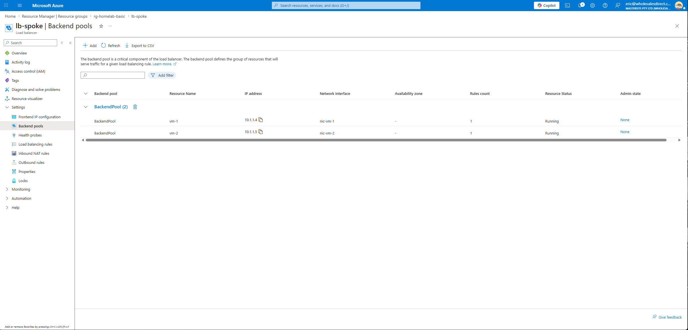

# Troubleshooting Log — Azure HomeLab Basic

Issues encountered during deployment and their resolutions. Each fix corresponds to a commit in git history.

---

## Issue 1: Standard_B1s Capacity Unavailable in Southeast Asia

**Error:**
```
SkuNotAvailable: The requested VM size for resource
'Following SKUs have failed for Capacity Restrictions: Standard_B1s'
is currently not available in location 'southeastasia'.
```

**Root cause:**
Azure regions can run out of physical capacity for specific VM sizes. `Standard_B1s` is a popular low-cost size that is frequently sold out, particularly in high-demand regions.

**Fix:**
Relocated the deployment to `Australia East` where capacity was available.

```hcl
# variables.tf
variable "location" {
  default = "Australia East"  # was "Southeast Asia"
}
```

**Diagnostic command:**
```powershell
az vm list-skus --location <region> --size Standard_B1s --output table
# If restrictions column is non-empty, the SKU is unavailable in that region
```

**Lesson:** Check SKU availability before deploying. When `SkuNotAvailable` appears, try a different region before reaching for a different VM size.

---

## Issue 2: Standard_B2s_v2 Quota is Zero on Subscription

**Error:**
```
OperationNotAllowed: standardBsv2Family Cores quota exceeded.
Current Limit: 0, Current Usage: 0, Additional Required: 2
```

**Root cause:**
`Standard_B2s_v2` belongs to the `standardBsv2Family` — a newer generation. Even on Pay-As-You-Go subscriptions, new VM families start with **zero quota** by default. Quota and capacity are separate concerns:

| Check | Tool | What it reveals |
|---|---|---|
| Capacity | `az vm list-skus` | Whether Azure has hardware available |
| Quota | `az vm list-usage` | Whether your subscription is allowed to use it |

Both must pass. A SKU with available capacity but zero quota still fails.

**B-series family split:**

| Family | Example sizes | Default quota |
|---|---|---|
| Standard BS Family (legacy) | `Standard_B1s`, `Standard_B2s` | 10 vCPUs |
| Standard Bsv2 Family (v2) | `Standard_B2s_v2`, `Standard_B4s_v2` | 0 vCPUs |

**Fix:**
Reverted to `Standard_B1s` (BS Family, quota = 10), then found it also had capacity constraints in Australia East — see Issue 3.

**Diagnostic command:**
```powershell
az vm list-usage --location australiaeast --output table | grep -i "BS\|Bsv2"
# Confirm Limit > 0 for the family before deploying
```

---

## Issue 3: Standard_B1s Also Unavailable in Australia East

**Error:**
```
SkuNotAvailable: The requested VM size for resource
'Following SKUs have failed for Capacity Restrictions: Standard_B1s'
is currently not available in location 'australiaeast'.
```

**Root cause:**
`Standard_B1s` (legacy BS Family) is sold out in Australia East as well. Quota exists (limit = 10) but Azure has no available hardware for this size in this region.

**Fix:**
Identified `Standard_D2s_v3` as having both available capacity and sufficient quota:

```powershell
# Step 1: Find SKUs with no capacity restrictions
az vm list-skus --location australiaeast --resource-type virtualMachines --output json |
  python3 -c "import json,sys; [print(s['name']) for s in json.load(sys.stdin) if not s.get('restrictions')]"
# Output included: Standard_D2s_v3

# Step 2: Confirm DSv3 family quota
az vm list-usage --location australiaeast --output table | grep DSv3
# Standard DSv3 Family vCPUs   0   10  ← Limit 10, 2 VMs x 2 vCPU = 4 total, within limit
```

```hcl
# variables.tf
variable "vm_size" {
  default = "Standard_D2s_v3"  # 2 vCPU, 8 GB RAM — confirmed available
}
```

**Lesson:** Always run both checks before choosing a VM size. A size can pass one check and fail the other.

---

## Issue 4: Terraform State Inconsistency After Interrupted Destroy

**Error:**
```
Provider produced inconsistent result after apply
Root object was present, but now absent.

waiting for provisioning state of Virtual Network: 404 Not Found
ResourceNotFound: The Resource 'Microsoft.Network/virtualNetworks/vnet-hub' was not found.
```

**Root cause:**
`terraform destroy` was interrupted mid-run. Azure partially deleted resources while the local `terraform.tfstate` still listed them as existing. The next `terraform apply` tried to update resources that no longer existed in Azure.

**Fix:**
1. Manually delete the resource group in the Azure Portal and wait for complete deletion
2. Remove the stale local state files:
   ```powershell
   Remove-Item terraform.tfstate
   Remove-Item terraform.tfstate.backup
   Remove-Item .terraform.tfstate.lock.info
   ```
3. Run `terraform apply` from a clean state

**Lesson:** Never interrupt a `terraform destroy`. If state corruption occurs, manual Portal cleanup followed by state file deletion is the fastest recovery path.

---

## Issue 5: Website Unreachable Despite Nginx Running

**Symptom:**
- `terraform apply` succeeded, LB public IP assigned
- Bastion SSH → `curl http://localhost` returns `<h1>Hello from vm-1</h1>` ✓
- Browser → `ERR_CONNECTION_TIMED_OUT` ✗
- LB backend pool health status shows `-`

**Root cause:**
Azure Standard Load Balancer preserves the **original client source IP** when forwarding traffic to backend VMs (DNAT only, no SNAT). The VM's NSG therefore sees requests arriving from the real client IP, not from the load balancer.

The initial NSG rule only allowed `source = AzureLoadBalancer`:

| Traffic type | Source IP seen by NSG | Matched by AzureLoadBalancer tag? |
|---|---|---|
| LB health probe | `168.63.129.16` | ✓ Yes |
| Client browser request | Client's real internet IP | ✗ No — blocked |

Health probes passed, so the backend showed as Healthy in some views, but all real user traffic was silently dropped by the NSG.

**Fix:**
Added a separate rule to allow HTTP from `Internet` in addition to the existing `AzureLoadBalancer` health probe rule:

```hcl
# network.tf — NSG rules
security_rule {
  name                  = "Allow-HTTP-from-Internet"
  priority              = 100
  source_address_prefix = "Internet"        # Covers all real client traffic
  destination_port_range = "80"
}

security_rule {
  name                  = "Allow-HTTP-from-LB-Probe"
  priority              = 110
  source_address_prefix = "AzureLoadBalancer"  # Covers health probe from 168.63.129.16
  destination_port_range = "80"
}
```

**Lesson:** When using Standard LB + NSG, two separate rules are required — one for client traffic (`Internet`) and one for health probes (`AzureLoadBalancer`). Using only `AzureLoadBalancer` makes the site unreachable even when Nginx is running perfectly.

**NSG rules after fix:**


**Backend pool after fix — both VMs healthy:**


