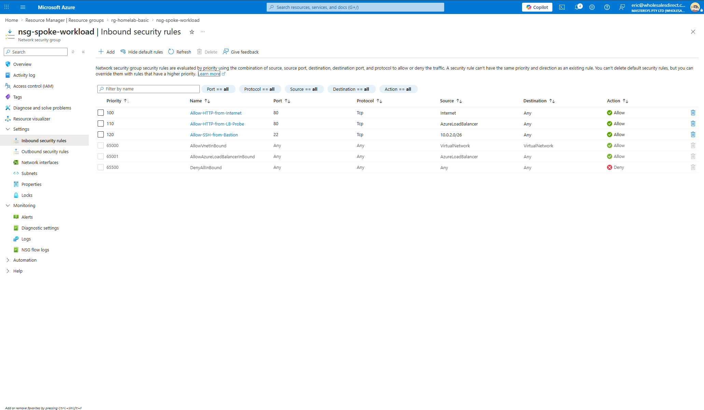

# 01 - Hub-Spoke Network

Terraform deployment of a hub-spoke network on Azure: two peered VNets, a Standard Load
Balancer distributing HTTP traffic across two Nginx VMs, Azure Bastion for SSH without public
port 22, and NSG rules scoped by service tag.

| | |
|---|---|
| **Goal** | Build and operate the core AZ-104 networking pattern end to end |
| **Resource group** | `rg-homelab-basic` (Australia East) |
| **Stack** | Terraform >= 1.5, azurerm provider, Ubuntu 22.04, Nginx |
| **Deploy time** | 10-15 minutes (Azure Bastion accounts for about 10) |
| **Status** | Complete - deployed, verified, destroyed |
| **Issues resolved** | 5 - see [TROUBLESHOOTING.md](TROUBLESHOOTING.md) |

---

## Overview

The hub VNet holds shared services (Azure Bastion and an optional VPN Gateway). The spoke VNet
holds the workload: two Linux VMs running Nginx behind a Standard Load Balancer. The VNets
are peered in both directions, and the only way to reach the VMs over SSH is through Bastion
in the hub.

The design demonstrates three things:

1. **Network isolation** - workloads live in a separate VNet and are reachable only through
   explicitly allowed paths.
2. **Load-balanced availability** - health probes remove an unhealthy VM from rotation
   automatically.
3. **No public management ports** - SSH is available only from the Bastion subnet.

## Architecture

```
                                   Internet
                                      |
                                   HTTP :80
                                      |
                             +------------------+
                             |      pip-lb      |
                             | Static Public IP |
                             +------------------+
                                      |
+----------------------------------------------------------+
|            Resource Group: rg-homelab-basic              |
|                      Australia East                      |
+----------------------------------------------------------+
          |                                      |
+---------+------------+          +--------------+----------+
| Hub VNet 10.0.0.0/16 |          | Spoke VNet 10.1.0.0/16  |
+----------------------+          +-------------------------+
|                      |          |                         |
| GatewaySubnet        |          | workload-subnet         |
| 10.0.1.0/27          |          | 10.1.1.0/24             |
| [VPN GW - disabled]  |  VNet    |                         |
|                      | Peering  | NSG (nsg-spoke-workload)|
| AzureBastionSubnet   |<========>| Internet     -> :80     |
| 10.0.2.0/26          |(bidirect)| AzureLoadBalancer -> :80|
|                      |          | 10.0.2.0/26  -> :22     |
| +------------------+ |          |                         |
| | Azure Bastion    | |          | Standard Load Balancer  |
| | bastion-hub      +-+--SSH:22->|   lb-spoke              |
| | Basic SKU        | |          |   HTTP probe :80 / 5s   |
| +------------------+ |          |        /         \      |
|                      |          |       / Round-robin \   |
+----------------------+          |   [vm-1]         [vm-2] |
         |                        |   Nginx           Nginx |
    +-----------+                 |   Ubuntu 22.04  D2s_v3  |
    |pip-bastion|                 +-------------------------+
    | Static IP |
    +-----------+
         |
    Browser HTTPS
    (SSH management)
```

## Components

| Component | Configuration | Purpose |
|---|---|---|
| Hub VNet | `10.0.0.0/16` with `GatewaySubnet` and `AzureBastionSubnet` | Shared services |
| Spoke VNet | `10.1.0.0/16` with `workload-subnet` | Application workload |
| VNet peering | Bidirectional, gateway transit enabled on the hub side | Hub-spoke connectivity |
| Standard Load Balancer | Static public IP, HTTP probe on port 80 every 5 seconds | Distributes traffic across VMs |
| Virtual machines | 2 x Ubuntu 22.04, `Standard_D2s_v3`, Nginx installed via cloud-init | Web tier |
| Azure Bastion | Basic SKU | Browser-based SSH, no public port 22 |
| Network Security Group | See rules below | Least-privilege inbound access |
| VPN Gateway | `VpnGw1`, RouteBased (commented out by default) | Optional site-to-site connectivity |

### NSG inbound rules (`nsg-spoke-workload`)

| Priority | Name | Source | Port | Reason |
|---|---|---|---|---|
| 100 | Allow-HTTP-from-Internet | `Internet` | 80 | Client traffic (Standard LB preserves the client source IP) |
| 110 | Allow-HTTP-from-LB-Probe | `AzureLoadBalancer` | 80 | Health probes from `168.63.129.16` |
| 120 | Allow-SSH-from-Bastion | `10.0.2.0/26` | 22 | Management access through Bastion only |

## Repository contents

| File | Purpose |
|---|---|
| `terraform/main.tf` | Provider configuration and resource group |
| `terraform/variables.tf` | Input variables and defaults (region, VM size, admin user) |
| `terraform/network.tf` | VNets, subnets, peering, NSG and NSG association |
| `terraform/compute.tf` | NICs, backend pool associations, VMs with cloud-init |
| `terraform/loadbalancer.tf` | Public IP, load balancer, health probe, load-balancing rule |
| `terraform/vpn.tf` | Azure Bastion, and the VPN Gateway (commented out) |
| `terraform/outputs.tf` | Load balancer public IP and Bastion name |
| `screenshots/` | Portal evidence of the working deployment |
| `TROUBLESHOOTING.md` | Deployment issues and their root causes |

## Deployment

### Prerequisites

- Azure CLI, signed in with `az login`
- Terraform 1.5.0 or later
- Standard DSv3 family quota of at least 4 vCPUs in the target region (2 VMs x 2 vCPUs)

### Deploy

```powershell
$env:TF_VAR_admin_password = "<strong-password>"
cd terraform
terraform init
terraform plan
terraform apply
```

### Verify

1. Open the `load_balancer_public_ip` output in a browser.
2. Refresh several times; the response alternates between `Hello from vm-1` and `Hello from vm-2`.
3. In the Portal, open `lb-spoke` > Backend pools and confirm both VMs report Healthy.

### Clean up

```powershell
terraform destroy -auto-approve
```

Confirm that `rg-homelab-basic` no longer exists in the Portal. Do not interrupt a running
destroy (see Issue 4 in the troubleshooting log).

## Evidence

**Load balancer backend pool - both VMs healthy**


**NSG inbound rules after the Issue 5 fix**



## Cost controls

| Measure | Detail |
|---|---|
| Budget alert | AUD 50 budget with email notifications at 50, 80 and 100 percent (Cost Management) |
| VM size | `Standard_D2s_v3` - the smallest size with both capacity and quota available (see Issues 1-3) |
| OS disk | `Standard_LRS`, roughly 60 percent cheaper than Premium SSD |
| Bastion SKU | Basic, roughly 50 percent cheaper than Standard |
| VPN Gateway | Disabled by default; costs about AUD 6 per day when running |
| Tagging | `Project=HomeLab-Basic` for filtering in Cost Management |

## Skills demonstrated

| Area | Detail |
|---|---|
| Terraform | Multi-file layout, variables, outputs, recovery from corrupted state |
| Azure networking | VNet design, CIDR planning, bidirectional peering, gateway transit |
| Network security | NSG rule priorities and service tags; Standard LB source-IP behaviour |
| Load balancing | Standard SKU, health probes, backend pools |
| Secure access | Azure Bastion in place of a jump box or public SSH |
| Capacity planning | Distinguishing regional SKU capacity from subscription quota |

## Related documents

- [TROUBLESHOOTING.md](TROUBLESHOOTING.md) - five deployment issues with root cause and fix
- [Azure HomeLab overview](../README.md)
