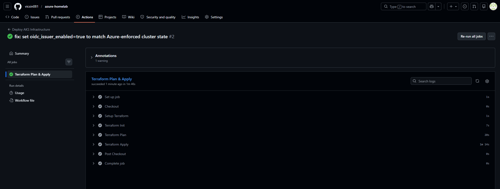
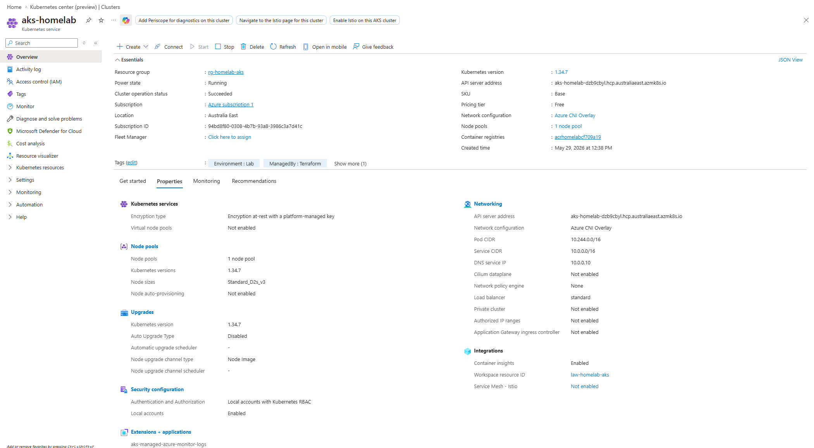
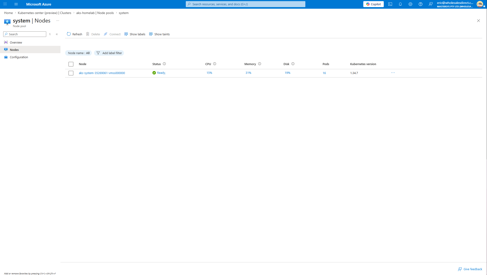
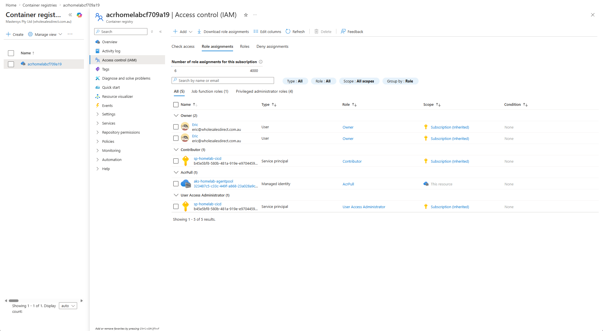
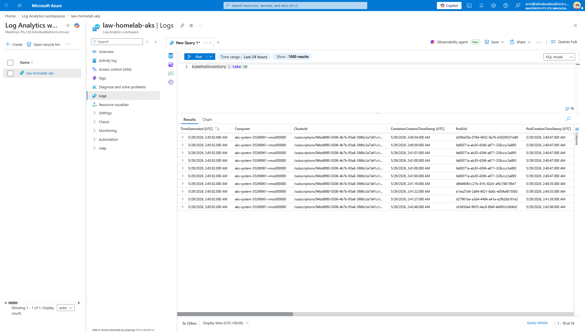
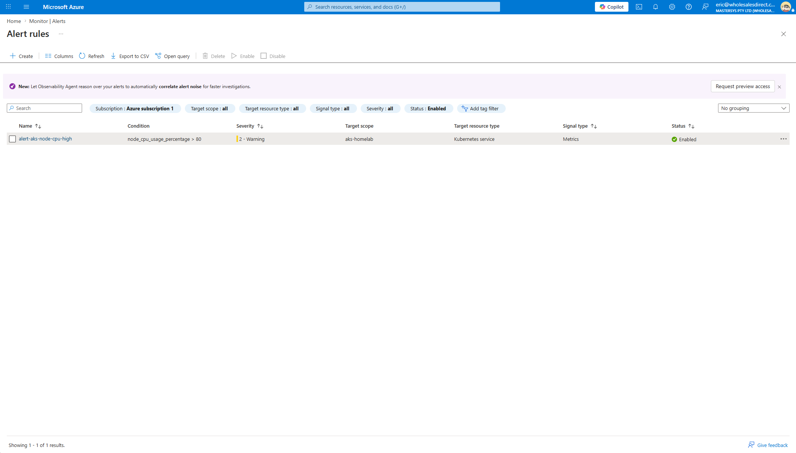

# 02 - AKS, CI/CD and Monitoring

A GitHub Actions pipeline that runs Terraform to deploy an Azure Kubernetes Service cluster with
a managed identity, an Azure Container Registry that the cluster pulls from without stored
credentials, and Log Analytics monitoring with a CPU alert. Terraform state is kept in Azure Blob
Storage so the pipeline and a local workstation share the same state.

| | |
|---|---|
| **Goal** | Automate infrastructure delivery and apply identity-based access and monitoring to a container platform |
| **Resource group** | `rg-homelab-aks` (Australia East) |
| **Stack** | Terraform >= 1.5, azurerm provider, GitHub Actions, AKS, ACR, Log Analytics |
| **Deploy time** | 8-12 minutes (AKS node provisioning accounts for most of it) |
| **Status** | Complete - deployed through the pipeline, verified, destroyed |
| **Issues resolved** | 3 - see [TROUBLESHOOTING.md](TROUBLESHOOTING.md) |

---

## Overview

A push that changes the Terraform code starts a GitHub Actions run. The runner signs in to Azure
with a service principal held in GitHub Secrets, reads the shared state from Blob Storage, and
runs `terraform plan` followed by `terraform apply`.

The deployed platform follows three principles:

1. **No stored credentials between services** - ACR's admin account is disabled; AKS pulls
   images through an `AcrPull` role assignment on its kubelet identity.
2. **Least-privilege roles** - each identity gets only the built-in role it needs, scoped to the
   narrowest resource.
3. **Observable by default** - Container Insights sends node and pod data to Log Analytics, and
   a metric alert fires when average node CPU exceeds 80 percent.

## Architecture

```
GitHub push to master
        |
        | (path filter: 02-aks-cicd-monitor/terraform/**)
        v
+-------------------------+
|   GitHub Actions        |
|   ubuntu-latest runner  |
|   terraform init        |
|   terraform plan        |
|   terraform apply       |
+-------------------------+
        |
        | ARM credentials (GitHub Secrets)
        v
+----------------------------------------------------------+
|        Resource Group: rg-homelab-aks  (Australia East)  |
+----------------------------------------------------------+
|                                                          |
|  +----------------------+    AcrPull role assignment     |
|  | AKS  aks-homelab     |------------------------------> |
|  | 1 x Standard_D2s_v3  |    Azure Container Registry    |
|  | System-assigned MI   |    acrhomelab<id> (Basic SKU)  |
|  | OMS agent enabled    |    admin_enabled = false       |
|  +----------------------+                                |
|           |                                              |
|           | metrics and logs                             |
|           v                                              |
|  +----------------------+                                |
|  | Log Analytics        |                                |
|  | law-homelab-aks      |                                |
|  | 30-day retention     |                                |
|  +----------------------+                                |
|           |                                              |
|           | node CPU > 80 percent                        |
|           v                                              |
|  +----------------------+                                |
|  | Monitor metric alert |                                |
|  | alert-aks-node-cpu   |                                |
|  +----------------------+                                |
|                                                          |
+----------------------------------------------------------+

Terraform state: Azure Blob Storage (rg-tfstate / satfstate*)
```

## Components

| Component | Configuration | Purpose |
|---|---|---|
| AKS cluster | 1 node, `Standard_D2s_v3`, system-assigned managed identity, OIDC issuer enabled | Container platform |
| Azure Container Registry | Basic SKU, admin account disabled, random name suffix | Private image registry |
| Role assignment | AKS kubelet identity to `AcrPull` on the registry | Credential-free image pulls |
| Log Analytics workspace | `PerGB2018` SKU, 30-day retention, Container Insights via the OMS agent | Logs and metrics |
| Metric alert | `node_cpu_usage_percentage` average above 80, severity 2 | Capacity warning |
| GitHub Actions workflow | Runs on push to `02-aks-cicd-monitor/terraform/**` or manually | Continuous deployment |
| Terraform backend | Azure Blob Storage container `tfstate` | Shared, locked remote state |

## Repository contents

| File | Purpose |
|---|---|
| `terraform/main.tf` | Provider configuration, remote backend, resource group |
| `terraform/variables.tf` | Input variables and defaults |
| `terraform/aks.tf` | AKS cluster, node pool, OMS agent |
| `terraform/acr.tf` | Container registry with a random suffix |
| `terraform/rbac.tf` | `AcrPull` role assignment for the kubelet identity |
| `terraform/monitoring.tf` | Log Analytics workspace and CPU metric alert |
| `terraform/outputs.tf` | Cluster name, ACR login server, `kubectl` credentials command |
| [`../.github/workflows/deploy-aks.yml`](../.github/workflows/deploy-aks.yml) | GitHub Actions pipeline |
| `screenshots/` | Evidence from GitHub and the Azure Portal |
| `TROUBLESHOOTING.md` | Deployment issues and their root causes |

## Deployment

### Prerequisites

- Azure CLI, signed in with `az login`
- Terraform 1.5.0 or later
- A GitHub repository with Actions enabled

### 1. Bootstrap (one time)

Create the storage account for remote state and a service principal for the pipeline.

```powershell
$SUB = az account show --query id -o tsv

# Remote state storage
az group create --name rg-tfstate --location australiaeast
az storage account create `
  --name satfstatehomelab `
  --resource-group rg-tfstate `
  --sku Standard_LRS `
  --allow-blob-public-access false
az storage container create --name tfstate --account-name satfstatehomelab

# Service principal for GitHub Actions
az ad sp create-for-rbac --name "sp-homelab-cicd" --role Contributor --scopes /subscriptions/$SUB
az role assignment create `
  --assignee "<appId from the previous command>" `
  --role "User Access Administrator" `
  --scopes /subscriptions/$SUB
```

`User Access Administrator` is required because the configuration creates a role assignment;
`Contributor` alone cannot do this (see Issue 2). Storage account names are globally unique, so
add a suffix if `satfstatehomelab` is taken.

### 2. GitHub Secrets

Repository **Settings > Secrets and variables > Actions**:

| Secret | Value |
|---|---|
| `ARM_CLIENT_ID` | `appId` from the service principal output |
| `ARM_CLIENT_SECRET` | `password` from the service principal output |
| `ARM_TENANT_ID` | `tenant` from the service principal output |
| `ARM_SUBSCRIPTION_ID` | Output of `az account show --query id -o tsv` |
| `TF_STATE_RESOURCE_GROUP` | `rg-tfstate` |
| `TF_STATE_STORAGE_ACCOUNT` | The storage account name |

### 3. Deploy

**Through the pipeline:** push a change under `02-aks-cicd-monitor/terraform/`, or run
**Actions > Deploy AKS Infrastructure > Run workflow**.

**From a workstation:**

```powershell
cd terraform
terraform init `
  -backend-config="resource_group_name=rg-tfstate" `
  -backend-config="storage_account_name=satfstatehomelab" `
  -backend-config="container_name=tfstate" `
  -backend-config="key=homelab-aks.tfstate"
terraform plan
terraform apply
```

### 4. Verify

```powershell
az aks get-credentials --resource-group rg-homelab-aks --name aks-homelab
kubectl get nodes                 # node status Ready
kubectl get pods -n kube-system   # system pods Running
```

In Log Analytics, run `KubePodInventory | take 10` to confirm Container Insights is sending data.

### 5. Clean up

```powershell
cd terraform
terraform destroy -auto-approve
```

The `rg-tfstate` resource group is kept on purpose; delete it manually when it is no longer needed.

## Evidence

| # | Screenshot | What it shows |
|---|---|---|
| 1 | GitHub Actions run | Init, plan and apply all succeeded |
| 2 | AKS overview | Cluster running |
| 3 | Node pool | Node in Ready state |
| 4 | ACR access control | `AcrPull` assigned to the AKS kubelet identity |
| 5 | Log Analytics | `KubePodInventory` query returning results |
| 6 | Monitor alert rules | CPU alert enabled |

**1. GitHub Actions - successful run**



**2. AKS cluster overview**



**3. Node pool - node Ready**



**4. ACR - AcrPull role assignment**



**5. Log Analytics - KubePodInventory query**



**6. Azure Monitor - CPU alert rule**



## Cost controls

| Measure | Detail |
|---|---|
| Node count | One node; scale out only when needed |
| VM size | `Standard_D2s_v3`, matching the quota confirmed in project 01 |
| ACR SKU | Basic |
| Log retention | 30 days, within the retention period included in ingestion pricing |
| Storage | No persistent volumes; stateless workloads only |
| Tagging | `Project=HomeLab-AKS` for filtering in Cost Management |

Estimated running cost is AUD 8-12 per day (the AKS control plane is free; the VM, ACR and Log
Analytics are billed). The environment is destroyed when not in use.

## Skills demonstrated

| Area | Detail |
|---|---|
| CI/CD | GitHub Actions running Terraform with secrets and a remote backend |
| Identity | System-assigned managed identity, service principals |
| RBAC | Built-in roles (`AcrPull`, `Contributor`, `User Access Administrator`) and scope |
| Containers | AKS node pools, ACR without admin credentials |
| Monitoring | Log Analytics, Container Insights, KQL, metric alerts |
| Terraform | Remote state in Blob Storage, handling provider drift against platform defaults |

## Related documents

- [TROUBLESHOOTING.md](TROUBLESHOOTING.md) - three pipeline and deployment issues with root cause and fix
- [Azure HomeLab overview](../README.md)
